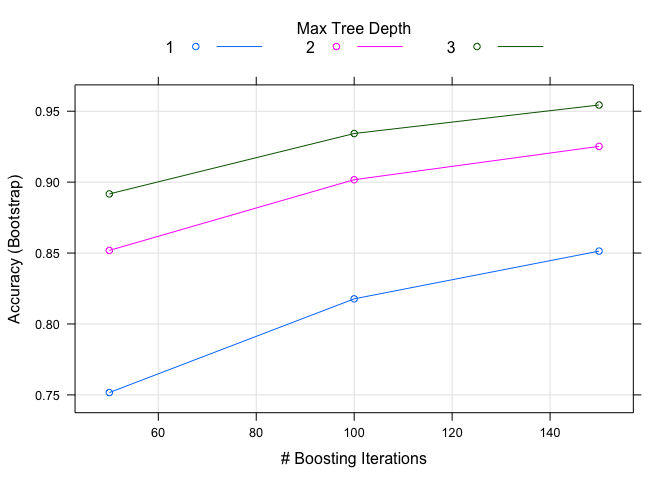

# Weight Lifting
Ryan Kraft  
November 19, 2015  
This project is to distinguish between correct lifting of a dumbbell and incorrect lifting.  I used the GBM method to determine what the lifting methods was.  I had to remove  107 variables, mostly due to a significant amount of NA values.  The next set removed was id and time stamp information that would lead to a bad model. 


```r
#  pml-training can be found here https://d396qusza40orc.cloudfront.net/predmachlearn/pml-training.csv and pml-testing can be found here https://d396qusza40orc.cloudfront.net/predmachlearn/pml-testing.csv
read.csv("pml-training.csv") -> training
pml_test <- read.csv("pml-testing.csv")
set.seed(324)
```

Here is a full list of variables removed.

```r
training_names <- training[, ! apply(training, 2, function(x) any(is.na(x)))]
library(dplyr)
```

```
## 
## Attaching package: 'dplyr'
## 
## The following object is masked from 'package:stats':
## 
##     filter
## 
## The following objects are masked from 'package:base':
## 
##     intersect, setdiff, setequal, union
```

```r
training_names <- select(training_names, -X, -user_name, -raw_timestamp_part_1, -raw_timestamp_part_2, -cvtd_timestamp, -new_window, -num_window, -kurtosis_roll_belt, -kurtosis_picth_belt, -kurtosis_yaw_belt, -skewness_roll_belt, -skewness_roll_belt.1, -skewness_yaw_belt, -max_yaw_belt, -min_yaw_belt, -amplitude_yaw_belt, -kurtosis_roll_arm, -kurtosis_picth_arm, -kurtosis_yaw_arm, -skewness_roll_arm, -skewness_pitch_arm, -skewness_yaw_arm, -kurtosis_roll_dumbbell, -kurtosis_picth_dumbbell, -kurtosis_yaw_dumbbell, -skewness_roll_dumbbell, -skewness_pitch_dumbbell, -skewness_yaw_dumbbell, -max_yaw_dumbbell, -min_yaw_dumbbell, -amplitude_yaw_dumbbell, -kurtosis_roll_forearm, -kurtosis_picth_forearm, -kurtosis_picth_forearm, -kurtosis_yaw_forearm, -skewness_roll_forearm , -skewness_pitch_forearm, -skewness_yaw_forearm, -max_yaw_forearm, -min_yaw_forearm, -amplitude_yaw_forearm)
```

Breaking up the data into two parts to create the model and find the accuracy of the model.

```r
library(caret)
```

```
## Warning: package 'caret' was built under R version 3.1.3
```

```
## Loading required package: lattice
## Loading required package: ggplot2
```

```r
inTrain <- createDataPartition(training_names$classe, p = .65, list = FALSE)
training_names_train <- training_names[inTrain,]
training_names_test <- training_names[-inTrain,]
```
Creating the model. Fourth two variables were used in creation of the model.

```r
fit_gbm <- train(classe~., data=training_names_train, method = "gbm", verbose = F)
```
Predict on the test set to see accuracy of the model.

```r
result_gbm <- predict(fit_gbm, training_names_test)
```
I don't see many graphs that would be helpful do to the volume of variables.  This plot shows the progression of the model to its final stage.

```r
plot(fit_gbm)
```

 


```r
fit_gbm$finalModel
```

```
## A gradient boosted model with multinomial loss function.
## 150 iterations were performed.
## There were 52 predictors of which 42 had non-zero influence.
```

```r
confusionMatrix(result_gbm, training_names_test$classe)
```

```
## Confusion Matrix and Statistics
## 
##           Reference
## Prediction    A    B    C    D    E
##          A 1926   27    0    1    1
##          B   10 1263   39    7   17
##          C   15   37 1135   35    6
##          D    1    0   20 1076   15
##          E    1    1    3    6 1223
## 
## Overall Statistics
##                                          
##                Accuracy : 0.9647         
##                  95% CI : (0.9601, 0.969)
##     No Information Rate : 0.2845         
##     P-Value [Acc > NIR] : < 2.2e-16      
##                                          
##                   Kappa : 0.9554         
##  Mcnemar's Test P-Value : 7.339e-08      
## 
## Statistics by Class:
## 
##                      Class: A Class: B Class: C Class: D Class: E
## Sensitivity            0.9862   0.9511   0.9482   0.9564   0.9691
## Specificity            0.9941   0.9868   0.9836   0.9937   0.9980
## Pos Pred Value         0.9852   0.9454   0.9243   0.9676   0.9911
## Neg Pred Value         0.9945   0.9882   0.9890   0.9915   0.9931
## Prevalence             0.2845   0.1934   0.1744   0.1639   0.1838
## Detection Rate         0.2806   0.1840   0.1653   0.1567   0.1782
## Detection Prevalence   0.2848   0.1946   0.1789   0.1620   0.1798
## Balanced Accuracy      0.9901   0.9689   0.9659   0.9751   0.9836
```
The accuracy is 96.47%. To my understanding this is relatively good accuracy. It is enough to get the assignment correct. Below is the answers to the assignment.

```r
result_gbm_plm <- predict(fit_gbm, pml_test)
print(result_gbm_plm)
```

```
##  [1] B A B A A E D B A A B C B A E E A B B B
## Levels: A B C D E
```
